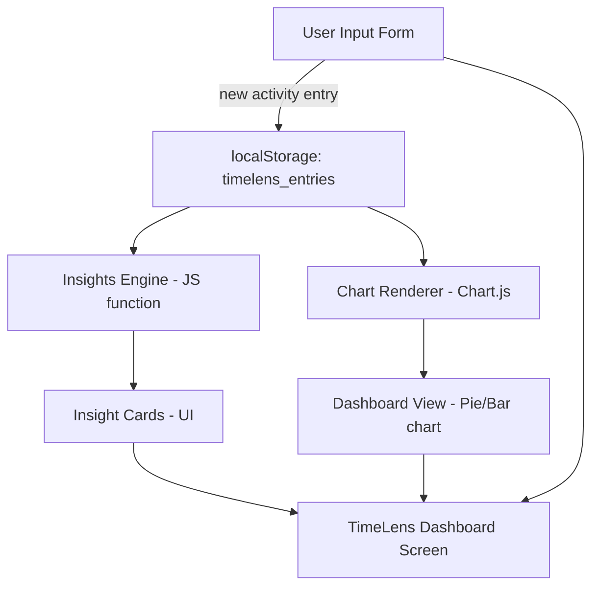

# TimeLens — Architecture

**"See where your day actually goes, and what to do about it"**

Theme: Time Management — help users analyze how they spend their time across various activities
Constraint: 1.5-hour hackathon build → this architecture is deliberately lean, no-backend, and demo-ready.

---

## 1. Problem & Goals

Most people *feel* busy but can't say where their hours actually went. TimeLens lets a user log activities during the day, then instantly visualizes the split (work / study / leisure / sleep / social / etc.) and surfaces a couple of plain-language observations ("You spent 4.5h on your phone today — that's more than sleep.").

**Goals for this build:**
- Log an activity in under 5 seconds
- See a visual breakdown of the day (chart)
- Get at least 1 auto-generated insight/suggestion
- Everything works with zero backend setup, zero auth, zero deployment friction

---

## 2. Scope Decisions (why the stack looks like this)

| Decision | Reasoning |
|---|---|
| No backend/server | Setting up a DB + API would burn 30+ of your 90 minutes. Skip it. |
| No user accounts/login | Not needed to prove the concept. Adds friction and time cost. |
| Client-side storage only | `localStorage` persists data across refresh, which is enough for a demo. |
| Single HTML page (or 2–3 components) | One file = no build tooling, no config, works instantly in browser. |
| Pre-seeded demo data | Live-typing 10 activities on stage is slow. Ship a "Load Sample Day" button. |

**Explicitly out of scope (say this out loud in your pitch — judges respect clear scoping):**
- Multi-day history / trends over weeks
- Login, multi-user support
- Calendar/app integrations (Google Calendar, screen-time APIs)
- Mobile app / native tracking

---

## 3. Tech Stack

- **Structure:** HTML5
- **Styling:** Tailwind CSS (CDN — no install step: `<script src="https://cdn.tailwindcss.com"></script>`)
- **Logic:** Vanilla JavaScript (ES6) — skip React/Vue; the setup cost isn't worth it at this scale
- **Charts:** Chart.js via CDN (`<script src="https://cdn.jsdelivr.net/npm/chart.js"></script>`)
- **Persistence:** `localStorage` (JSON blob, one key: `timelens_entries`)
- **Hosting for demo:** open the HTML file directly, or drag-and-drop onto Netlify Drop if you want a shareable link

No `npm install`, no bundler, no backend. Open the file in a browser and it works.

---

## 4. System Architecture



Everything runs client-side in one page. There is no server round-trip — every action (add entry → update chart → regenerate insight) happens instantly in the browser.

---

## 5. Data Model

Single array of entry objects, stored as JSON in `localStorage`:

```json
{
  "id": "e1",
  "activity": "Studying DSA",
  "category": "Study",
  "startTime": "14:00",
  "endTime": "15:30",
  "durationMins": 90
}
```

**Suggested fixed categories** (keep it a dropdown, not free text — much faster to log and to chart):
`Sleep, Study/Work, Screen Time, Exercise, Social, Chores, Leisure, Commute, Other`

---

## 6. Core Components

1. **Entry Form** — activity name (optional), category (dropdown), start time, end time → computes duration → pushes to storage array → re-renders chart + insights.
2. **Storage Layer** — 3 tiny functions: `getEntries()`, `saveEntry(entry)`, `clearEntries()`. Wraps `localStorage.getItem/setItem` with `JSON.parse`/`JSON.stringify`.
3. **Dashboard / Chart** — one Chart.js pie or doughnut chart: category → total minutes. Re-draws on every new entry (destroy + recreate the chart instance, simplest approach under time pressure).
4. **Insights Engine** — a plain JS function, no AI/API call needed, e.g.:
   - Find the category with the highest total → "Most of your day went to **{category}** ({X}h)."
   - If `Screen Time > Sleep` → flag it.
   - If `Exercise == 0` and total logged `> 6h` → suggest a break.
   - If `Sleep < 6h` → "You're under-sleeping — consider winding down earlier."
5. **"Load Sample Day" button** — pre-fills 6–8 entries instantly for a smooth live demo.

---

## 7. User Flow

1. Land on page → see empty state with "Load Sample Day" or "Add your first activity"
2. Add entries (or load sample) → chart + insight cards update live
3. Glance at the doughnut chart → see the split at a glance
4. Read 1–2 insight cards → get a concrete, specific takeaway
5. (Stretch) Click "Reset Day" to clear and start over

---

## 8. Suggested Folder Structure

```
timelens/
├── index.html          # structure + Tailwind + Chart.js CDN links
├── style.css           # only if you need anything beyond Tailwind
└── app.js              # storage layer, chart render, insights engine, event handlers
```

Three files. That's it. Don't over-engineer the file layout — every extra file is a context-switch you don't have time for.

---

## 9. 90-Minute Build Plan

| Time | Task |
|---|---|
| 0:00–0:10 | Set up `index.html` skeleton, Tailwind + Chart.js CDN, page layout (form + chart area + insights area) |
| 0:10–0:35 | Build the entry form + storage layer (`getEntries`/`saveEntry`) + render list of logged entries |
| 0:35–1:00 | Wire up Chart.js doughnut chart driven by stored entries |
| 1:00–1:15 | Write the insights engine (3–4 simple if/else rules) + render insight cards |
| 1:15–1:20 | Add "Load Sample Day" button with hardcoded demo entries |
| 1:20–1:30 | Polish pass: empty states, colors per category, quick sanity test, prep 60-second pitch |

If you're short on time at any checkpoint, cut in this order: sample-day button → styling polish → extra insight rules. Never cut the chart — it's the visual proof of the idea.

---

## 10. Demo Script (60 seconds)

1. "We all *think* we know where our time goes — we usually don't." (5s)
2. Click "Load Sample Day" → chart populates instantly (10s)
3. Point at the doughnut chart: "Here's an actual day — half of it's screen time." (15s)
4. Point at an insight card: "TimeLens doesn't just show data, it tells you what it means." (15s)
5. Add one live entry to prove it's not a canned demo (10s)
6. Close: "This is a v0 — next we'd add streaks over multiple days and calendar import." (5s)

---

## 11. Stretch Goals (only if time remains)

- Bar chart toggle (day view) alongside the doughnut chart
- Color-code categories consistently across chart + entry list
- "Ideal day" comparison — user sets target hours per category, chart shows actual vs. target
- Export day as a shareable image/summary

## 12. Post-Hackathon Roadmap (mention, don't build)

- Real backend (Firebase/Supabase) for multi-day history
- Auth so a user's data persists across devices
- Calendar / screen-time API integrations for automatic logging
- Weekly trend view + streaks
